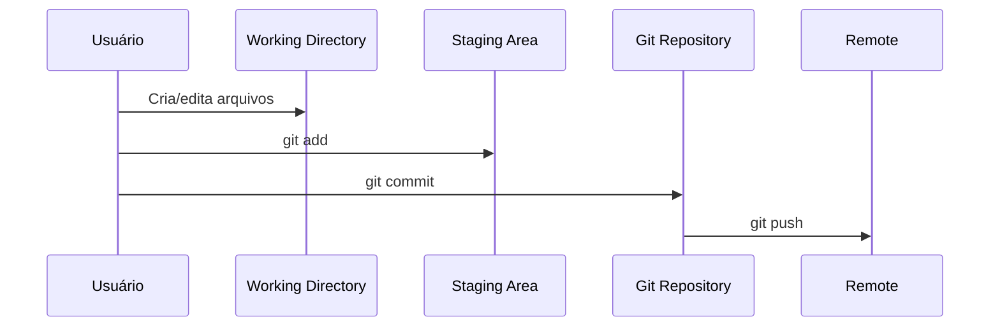

# 📖 Introdução ao Git

O **Git** é um sistema de controle de versão distribuído, criado por **Linus Torvalds** em 2005, que permite acompanhar e gerenciar mudanças em arquivos de um projeto.  

Ele é usado principalmente no desenvolvimento de software, mas pode ser aplicado a qualquer tipo de arquivo.  
Já o **GitHub** é uma plataforma online que hospeda repositórios Git e facilita a colaboração entre desenvolvedores.

---

## 🔑 Diferença entre Git e GitHub

- **Git** → ferramenta de versionamento que roda localmente na sua máquina.  
- **GitHub** → serviço online que hospeda os repositórios Git e adiciona recursos de colaboração.  

📌 Resumindo:  
- Você pode usar **Git sem GitHub**.  
- Mas não pode usar **GitHub sem Git**.

---

## 📂 Fluxo de Arquivos no Git

O Git organiza os arquivos em **três áreas principais**:


- **Working Directory** → onde você cria e altera os arquivos no seu projeto.
- **Staging Area** → uma “pré-lista” dos arquivos que você deseja incluir no commit.
- **Git Repository** → banco de dados interno do Git, onde ficam os commits salvos.


## ⚡ Fluxo Básico do Git


## 📌 Exemplo Prático
```bash
# 1. Criar um novo repositório
git init

# 2. Criar um arquivo
echo "Hello Git" > readme.txt

# 3. Adicionar à área de stage
git add readme.txt

# 4. Salvar no repositório
git commit -m "primeiro commit"
```

## 🎯 Resumo Rápido

1. **git init** → cria um novo repositório.
2. **git add** → prepara os arquivos para commit.
3. **git commit** → salva as mudanças no repositório.
4. **git push** → envia para o servidor remoto (GitHub).
