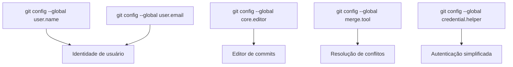

# ⚙️ Configuração Inicial do Git

Antes de começar a usar o **Git**, é importante fazer algumas configurações básicas para identificar suas alterações e garantir que o fluxo de trabalho seja consistente.

---

## 👤 Configurar Identidade do Usuário

Essas informações aparecerão em todos os commits que você fizer.

```bash
# Define seu nome de usuário
git config --global user.name "Seu Nome"

# Define seu e-mail
git config --global user.email "seuemail@exemplo.com"
```

## 🔎 Exemplo de commit após configuração:
```bash
Author: João Silva <joao.silva@email.com>
Date:   Sat Aug 30 12:34:56 2025 -0300

    Adiciona README inicial
```

## 📝 Configurar Editor Padrão e Ferramenta de Merge

Você pode escolher como resolver conflitos: diretamente na IDE (modo moderno) ou via terminal com `git mergetool` (modo clássico).

> 💡 **Observação:** Hoje, muitos devs preferem usar o VS Code diretamente, sem `git mergetool`.  
> A configuração com `mergetool` é útil se você gosta de abrir conflitos via terminal.

```bash
# 🔹 Merge tool (modo clássico)
git config --global merge.tool vscode
git config --global mergetool.vscode.cmd "code --wait $MERGED"

# 🔹 Alternativa moderna: VS Code como editor padrão
git config --global core.editor "code --wait"
```
✅ Resumo Visual
- **Modo Clássico (git mergetool)**: abre cada conflito via terminal → útil para fluxos mais manuais.
- **Modo Moderno (VS Code)**: conflitos são detectados automaticamente na IDE → mais rápido e visual.

## 🔀 Configurar Ferramenta de Merge
Se houver conflitos, o Git pode usar ferramentas externas para ajudar na resolução.
```bash
# Exemplo com VS Code
git config --global merge.tool vscode
git config --global mergetool.vscode.cmd "code --wait $MERGED"
```

## 🔐 Configurar Armazenamento de Credenciais
Para não precisar digitar usuário e senha a cada operação no GitHub:
```bash
# Ativar o cache de credenciais
git config --global credential.helper cache

# Ou armazenar de forma persistente
git config --global credential.helper store
```

## 🛠️ Outras Configurações Úteis
Para não precisar digitar usuário e senha a cada operação no GitHub:
```bash
# Define branch principal como "main" por padrão
git config --global init.defaultBranch main

# Exibe status em cores
git config --global color.ui auto

# Mostra log de forma compacta e bonita
git config --global format.pretty oneline
```

## 📋 Verificando Configurações
Para listar todas as configurações aplicadas:
```bash
git config --list
```
## 🎯 Resumo Visual

