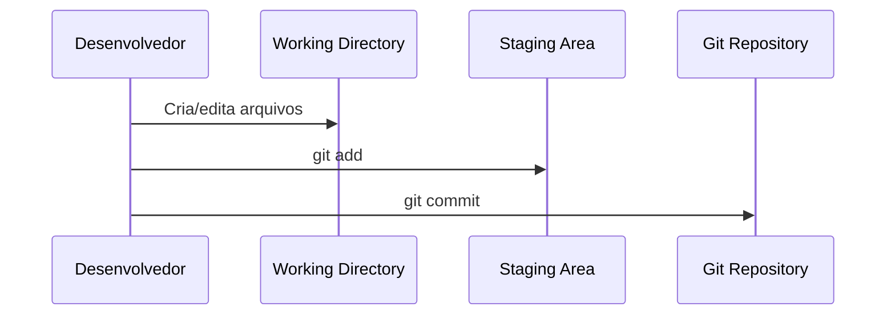

# 📂 Conceitos e Estrutura do Projeto Git

Para trabalhar com Git de forma eficiente, é importante entender como os arquivos são organizados e como o fluxo de alterações acontece.

---

## 🔑 Três Áreas do Git

O Git gerencia arquivos em **três áreas principais**:

1. **Working Directory (Diretório de Trabalho)**  
   Onde você cria e edita arquivos localmente.

2. **Staging Area (Área de Preparação / Stage)**  
   Espaço onde você seleciona os arquivos que serão incluídos no próximo commit.

3. **Git Repository (.git / Diretório Git)**  
   Local onde os commits são armazenados e o histórico do projeto é mantido.

---

## ⚡ Fluxo de Arquivos


- **WD → SA**: `git add` adiciona alterações à Staging Area.
- **SA → GR**: `git commit` salva as alterações no repositório local.
- **GR → Remote**: `git push` envia commits para o GitHub ou outro servidor remoto.

## 🔄 Ciclo de Alterações


- Criação ou edição → adiciona arquivos à Stage → commit para salvar no repositório local.

## 📌 Exemplo Prático
```bash
# 1. Criar novo arquivo
touch index.html

# 2. Verificar status
git status

# 3. Adicionar arquivo à Staging Area
git add index.html

# 4. Salvar commit
git commit -m "Adiciona index.html"
```

## 🎯 Dicas Rápidas
- Sempre verifique o status do projeto antes de commitar:
```bash
git status
```

- Para visualizar diferenças entre Working Directory e Staging Area:
```bash
git diff
```

- Para visualizar diferenças entre Staging Area e Git Repository:
```bash
git diff --staged
```

✅ Compreender essas áreas ajuda a evitar erros, controlar melhor o histórico e trabalhar de forma mais organizada.
