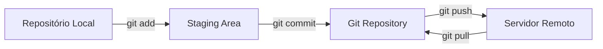

# 📁 Criando e Versionando Repositórios

Nesta seção, vamos aprender a **criar repositórios locais, iniciar versionamento e gerenciar arquivos**.  
Também veremos como **clonar repositórios remotos**.

---

## 1️⃣ Criando um Novo Repositório Local

```bash
# Cria uma pasta para o repositório
mkdir nome-do-repositorio

# Acesse a pasta
cd nome-do-repositorio
```

## 2️⃣ Inicializando o Versionamento com Git

```bash
# Inicializa um repositório Git na pasta
git init
```
> 💡 **Dica**: Após `git init`, a pasta `.git` será criada, onde o Git 
> armazena todo o histórico de commits. 

## 3️⃣ Criando Arquivos no Terminal

```bash
# Cria um novo arquivo
touch nome-arquivo.extensao

# Exemplo: criar um README
touch README.md
```

## 4️⃣ Listando Arquivos e Diretórios

```bash
# Lista todos os arquivos, incluindo ocultos
ls -a

# Lista detalhadamente arquivos e permissões
ls -la
```

## 5️⃣ Verificando o Status do Repositório

```bash
git status
```
- Mostra quais arquivos foram modificados, adicionados à Stage Area ou removidos.
- Útil para saber **o que será commitado**.

## 6️⃣ Ignorando Arquivos com .gitignore
Crie um arquivo `.gitignore` para **evitar versionar arquivos desnecessários**, como logs ou arquivos temporários:
```bash
# Exemplo de conteúdo do .gitignore
node_modules/
dist/
*.log
```
> 💡 **Dica**: Você também pode criar .gitignore usando modelos prontos: 
> [GitHub gitignore templates](https://github.com/github/gitignore)

## 7️⃣ Clonando um Repositório Remoto

```bash
# Copie a URL do repositório remoto (HTTPS ou SSH)
git clone url-do-repositorio
```
- Cria uma cópia local do repositório remoto.
- Após clonar, você já terá a pasta do projeto pronta para trabalhar.

## 8️⃣ Conectando a um Repositório Remoto

```bash
# Adiciona o caminho remoto (origin é o nome padrão)
git remote add origin url-do-repositorio

# Verifica os repositórios remotos configurados
git remote -v

# Altera a URL de um repositório remoto
git remote set-url origin nova-url
```

## 9️⃣ Resumo Visual do Fluxo


✅ Dicas práticas:
- Sempre verifique `git status` antes de adicionar ou commitar arquivos.
- Use `.gitignore` para manter o repositório limpo.
- Prefira **clonar repositórios remotos** ao invés de criar do zero se o projeto já existir online.
