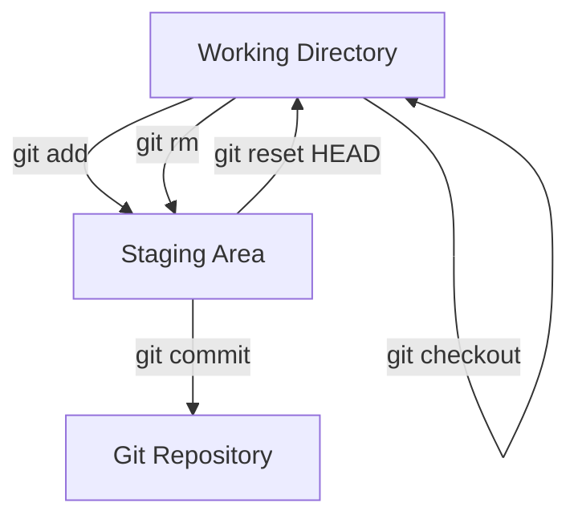

# 🗂️ Trabalhando com Arquivos no Git

O Git permite **adicionar, remover e restaurar arquivos** de forma controlada.  
Entender como mover arquivos entre **Working Directory**, **Staging Area** e **Git Repository** é essencial.

---

## ➕ Adicionar Arquivos à Stage Area

Você pode adicionar arquivos individualmente, por extensão ou todos de uma vez:

```bash
# 1️⃣ Adiciona um arquivo específico
git add nome-arquivo.extensao

# 2️⃣ Adiciona todos arquivos de uma extensão
git add *.extensao

# 3️⃣ Adiciona todos os arquivos modificados
git add .

# 4️⃣ Adiciona todos arquivos, incluindo deletados
git add --all
```
💡 Dica: Sempre verifique o status antes de adicionar arquivos:

## ❌ Remover Arquivos

```bash
# Remove arquivo da Working Directory (restaura versão do último commit)
git checkout nome-arquivo.extensao

# Remove arquivo da Stage Area e do Git Repository
git rm nome-arquivo.extensao

# Remove todos arquivos deletados da Stage Area
git add --all

# Remove um diretório da Stage Area e do Git Repository
git rm -r nome-diretorio

# Remove um diretório apenas da Stage Area (mantém local)
git rm -rf nome-diretorio/ --cached
```
⚠️ Cuidado: `git rm -rf .` apaga todos arquivos do projeto e da Stage Area.

## 🔄 Restaurar Arquivos
```bash
# Desfaz alterações que ainda não foram adicionadas à Stage
git checkout -- nome-arquivo.extensao

# Remove da Stage Area sem deletar localmente
git reset HEAD nome-arquivo.extensao
```

## 📌 Visualizando Alterações
```bash
# Diferenças entre Working Directory e Stage Area
git diff

# Diferenças entre Stage Area e Git Repository
git diff --staged

# Visualiza alterações específicas de um arquivo
git diff nome-arquivo.extensao

# Visualiza somente os nomes dos arquivos modificados
git diff --name-only

# Ignora diferenças de espaços em branco
git diff -w
```

## 🎯 Resumo Visual


✅ Dica prática:
- Sempre use `git status` antes de `git add` ou `git rm`.
- Adicionar e remover arquivos corretamente ajuda a manter o histórico **limpo e organizado**.
