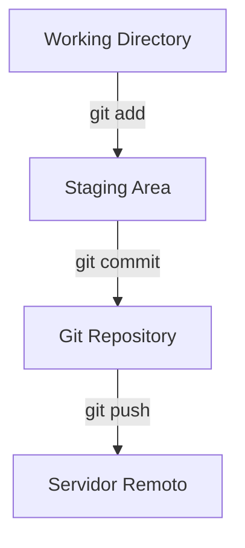

# 📝 Trabalhando com Commits

O **commit** é uma das operações mais importantes no Git. Ele salva um **snapshot** do seu projeto na **Staging Area** para o **Git Repository**.

Cada commit deve ter uma **mensagem significativa** que explique o que foi alterado.

---

## 📌 Commit Básico

Antes de criar um commit, você precisa adicionar os arquivos à Stage Area:

```bash
# Adiciona todos arquivos modificados
git add .

# Cria o commit com mensagem
git commit -m "Mensagem do commit"
```

## ⚡ Commit direto de arquivos já adicionados
```bash
# Adiciona e commita em um único passo (arquivos modificados)
git commit -a -m "Mensagem do commit"
git commit -am "Mensagem do commit"
```

## ✏️ Editar mensagem do último commit
Se você cometeu algo com mensagem incorreta:
```bash
git commit --amend -m "Nova mensagem do commit"
```

## 🔄 Revertendo Commits
Revertendo um commit específico
```bash
git revert <hash-do-commit>
```
- Cria um novo commit que desfaz as alterações do commit original.
- O hash do commit pode ser encontrado com: `git log --oneline`
- Abortando revert: `git revert --abort`

## 🚫 Excluir commits locais
Para apagar commits locais (cuidado!):
```bash
git reset --hard <hash-do-commit>
```
- Retorna o repositório para o estado do commit indicado.
- Alterações não commitadas serão perdidas.

## 💾 Stash: Guardando alterações temporariamente
Quando você precisa trocar de branch sem commitar mudanças:
```bash
# Guarda alterações temporariamente
git stash

# Visualiza stash
git stash list

# Aplica o último stash sem remover
git stash apply

# Aplica e remove o último stash
git stash pop

# Remove um stash específico
git stash drop stash@{0}

# Limpa todo o stash
git stash clear
```

## 🔍 Visualizando alterações (diff)
```bash
# Alterações na Working Directory (não adicionadas à Stage)
git diff

# Alterações na Stage Area (prontas para commit)
git diff --staged

# Alterações de um arquivo específico
git diff nome-arquivo.extensao

# Somente nomes dos arquivos alterados
git diff --name-only

# Ignora diferenças de espaços em branco
git diff -w

# Visualizar alterações de um commit específico
git show <hash-do-commit>

# Ver alterações entre dois commits
git diff <hash-commit1> <hash-commit2>

# Arquivos em conflito
git diff --name-only --diff-filter=U

```

## 🎯 Fluxo Visual de Commits



## 💡 Dicas Rápidas
- Mensagens de commit devem ser **curtas, claras e explicativas**.
- Use **imperativo**: “Adiciona README”, “Corrige bug X”.
- Commitar frequentemente ajuda no **controle e colaboração**.
- Utilize **stash** para guardar alterações temporárias e evitar perda de trabalho.
- **Commits semânticos**: siga padrões como **feat**, **fix**, **docs**, **refactor**, **chore**.  

Exemplos:  
- feat(login): adiciona autenticação via Google
- fix(button): corrige bug ao clicar duas vezes
- docs(readme): atualiza instruções de instalação

## ⚠️ Avisos de Segurança

| Comando | Risco / Atenção |
|---------|----------------|
| `git commit --amend` | Reescreve o último commit. **Não use em commits já enviados ao remoto**. |
| `git reset --hard <hash>` | Remove commits posteriores ao hash e alterações não commitadas. **Cuidado: perda de dados**. |
| `git stash clear` | Apaga todos os itens armazenados no stash. |
| `git revert <hash>` | Seguro, pois cria um commit que desfaz alterações do commit original. |
| `git diff` / `git show` | Seguro, apenas visualiza alterações. |

> **Dica**: Sempre verifique o status e as diferenças antes 
> de resetar ou alterar o histórico:
```bash
git status
git diff
```

## 📌 Resumo
1. **git add** → adiciona arquivos à Stage Area.
2. **git commit -m** → salva alterações no repositório.
3. **git commit -a -m** → adiciona e commita em um passo.
4. **git revert** → desfaz alterações de um commit criando novo commit.
5. **git reset** --hard → apaga commits locais.
6. **git stash** → guarda alterações temporariamente.
7. **git diff / git show** → visualiza alterações.
