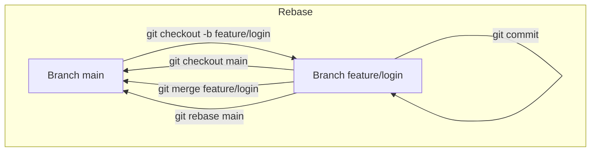

# 🌿 Trabalhando com Branches e Merges

O Git permite trabalhar com **ramificações (branches)** para desenvolver funcionalidades, corrigir bugs ou experimentar ideias sem afetar a branch principal.  
Usar branches facilita o **controle de versões**, o **trabalho em equipe** e a **resolução de conflitos**.

---

## 📌 Criando e Acessando Branches

```bash
# Criar uma nova branch
git branch nome-branch

# Acessar a branch
git checkout nome-branch

# Criar e acessar em um único comando
git checkout -b nome-branch

# Criar uma branch "órfã" (sem histórico)
git checkout --orphan nome-branch
```
> 💡 Dica: Use nomes descritivos como `feature/login`, 
> `bugfix/navbar` ou `hotfix/checkout`.

## 🔄 Atualizando Branches Remotas
```bash
# Baixa todas as branches remotas
git fetch --all

# Cria uma branch local baseada em uma remota
git checkout -b feature-x origin/feature-x
```

## ✏️ Renomeando Branches
```bash
# Renomeia a branch atual localmente
git branch -m novo-nome

# Para renomear e atualizar remoto
git push origin :old-branch       # Deleta branch antiga no remoto
git push --set-upstream origin novo-nome
```

## ❌ Deletando Branches
```bash
# Deleta branch local
git branch -D nome-branch

# Deleta branch remota
git push origin :nome-branch
```
⚠️ Atenção: Não delete branches ativas que outros colaboradores possam estar usando sem comunicação.

💡 Sempre verifique se a branch foi mergeada antes de apagar.

## 🔀 Realizando Merge
```bash
# Estar na branch de destino e unir alterações de outra branch
git merge nome-branch
```

## 🔄 Rebase (opcional)
```bash
# Rebase interativo para organizar commits locais antes de merge
git rebase main
```
- **Rebase** cria histórico linear, “movendo” commits da branch atual para cima da branch base.
- **Risco**: nunca faça rebase de commits que já foram enviados ao remoto, pois reescreve o histórico.

## ⚠️ Resolvendo Conflitos
Durante merge ou rebase, podem ocorrer conflitos:
```bash
# Aborta merge em andamento
git merge --abort

# Aborta rebase em andamento
git rebase --abort

# Abre mergetool configurada (ex: VS Code)
git mergetool
```
- O Git indicará arquivos em conflito com marcações `<<<<<<<`, `=======` e `>>>>>>>`.
- Resolva manualmente ou usando ferramentas externas.

## 🔍 Visualizando Branches
```bash
# Lista branches locais
git branch

# Lista branches locais e remotas
git branch -a
```

## 🌳 Merge vs Rebase

| Aspecto         | Merge                                  | Rebase                                |
|-----------------|---------------------------------------|--------------------------------------|
| Histórico       | Mantém ramificações visíveis          | Linear, mais limpo                    |
| Segurança       | Seguro para branches compartilhadas   | Risco se commits já enviados ao remoto |
| Conflitos       | Pode gerar commits de merge           | Conflitos resolvidos durante o processo, altera histórico |
| Uso recomendado | Integração final ou branches colaborativas | Limpeza de histórico local antes do merge |

> 💡 **Dica**: Em equipes, use **merge** para evitar problemas.
> Use **rebase** localmente para organizar commits antes de merge.

## 🎯 Fluxo Visual de Branches e Merge


## 💡 Dicas Rápidas
- Crie **branches para cada funcionalidade ou bug**.
- Mantenha a branch principal (`main` ou `master`) estável.
- Faça **pull e fetch** antes de merge ou rebase.
- Use **merge** para integrar alterações ou **rebase** para manter histórico linear.
- Nomeie branches de forma **clara e padronizada**.

## 📌 Resumo
1. **git branch** → cria ou lista branches.
2. **git checkout -b** → cria e acessa branch em um passo.
3. **git merge** → integra alterações de outra branch.
4. **git rebase** → reorganiza commits localmente.
5. **git fetch / git pull** → atualiza branches locais.
6. **git branch -D / git push origin :branch** → deletar branch local/remota.
7. **git mergetool / merge --abort / rebase --abort** → resolve conflitos.
