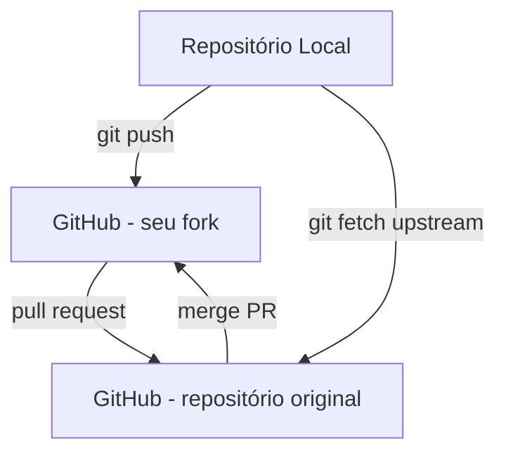

# 🌐 Trabalhando com GitHub

O GitHub é uma plataforma online que hospeda repositórios Git e facilita a **colaboração em equipe**, controle de versões e integração com ferramentas externas.  
Nesta seção, você aprenderá a configurar SSH, trabalhar com repositórios remotos, sincronizar forks e fechar issues diretamente via commits.

---

## 🔑 1. Configurando SSH para autenticação

Evita digitar usuário e senha toda vez que enviar ou baixar alterações.

```bash
# Gerar uma nova chave SSH
ssh-keygen -t rsa -b 4096 -C "seuemail@exemplo.com"

# Visualizar chave pública (Linux)
cat ~/.ssh/id_rsa.pub

# Visualizar chave pública (Mac)
cat /Users/<usuario>/.ssh/id_rsa.pub
```

## Adicionando a chave ao GitHub
1. Acesse **Settings > SSH and GPG keys > New SSH key**.
2. Cole a chave pública e defina um título identificando sua máquina.
3. Teste a conexão:

```bash
ssh -T git@github.com
```
> 💡 Dica: Use sempre uma chave por máquina e nunca compartilhe a privada.

## 📦 2. Trabalhando com repositórios remotos
**Adicionando um repositório remoto**
```bash
git remote add origin git@github.com:usuario/repositorio.git
```

**Verificando repositórios remotos**
```bash
git remote -v
```

**Alterando a URL do remoto**
```bash
git remote set-url origin git@github.com:usuario/repositorio.git
```

**Removendo um repositório remoto**
```bash
git remote rm origin
```

**Enviando alterações**
```bash
git push origin main
```

**Baixando alterações**
```bash
git fetch origin
git pull origin main
```
> 💡 Dica: Sempre use `git fetch` antes de `git pull` para revisar alterações remotas.

## 🔀 3. Trabalhando com Fork e Upstream
Quando você deseja contribuir para um repositório de outra pessoa:
1. Faça um **fork** no GitHub.
2. Clone seu fork localmente:
```bash
git clone git@github.com:seuusuario/repositorio.git
```

3. Adicione o repositório original como upstream:
```bash
git remote add upstream git@github.com:autor-original/repositorio.git
```

4. Sincronize alterações do upstream:
```bash
git fetch upstream
git checkout main
git merge upstream/main
```
> 💡 Dica: Mantenha seu fork atualizado para evitar conflitos 
> antes de criar pull requests.

## 📝 4. Fechando Issues via Commit
Você pode fechar automaticamente uma issue quando o commit for mergeado:
```bash
git commit -m "Corrige bug de login - fix #42"
```
Palavras-chave suportadas pelo GitHub:

`fix, fixes, fixed, close, closes, closed, resolve, resolves, resolved`

O número da issue vem da URL: ex: #42.

## ⚠️ Boas práticas e cuidados
- Nunca compartilhe sua `chave SSH privada`.
- Evite `push -f` em branches compartilhadas.
- Trabalhe sempre em **branches de feature ou bugfix**.
- Antes de abrir um pull request, sincronize sua branch:

```bash
git fetch upstream
git rebase upstream/main
```
ou
```bash
git merge upstream/main
```
- Use mensagens de commit claras e semânticas (`feat`:, `fix`:, `chore`:).
- Para alterações grandes, prefira **pull requests pequenos**.
- Verifique status e histórico antes de enviar:

##
```bash
git status
git log --oneline --graph --decorate
```

🌳 Fluxo Visual - GitHub e Repositórios Remotos


## 💡 Resumo Rápido
- Configure **SSH** para autenticação sem senha.
- Sempre crie **branches separadas** para cada feature ou correção.
- Mantenha forks **atualizados** com o upstream.
- Feche issues via **commit** usando palavras-chave.
- Revise alterações e histórico antes de **push** ou **merge**.
