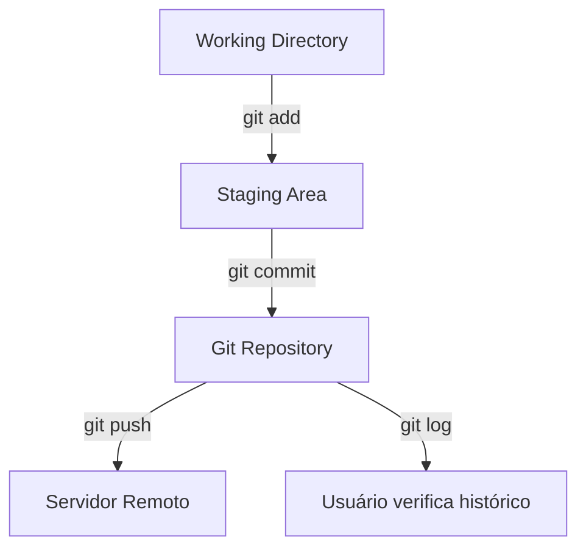

# 📜 Histórico e Relatórios no Git

Manter um **histórico organizado** é essencial para acompanhar mudanças, auditar código e colaborar em equipe.  
O Git oferece diversos comandos para visualizar commits, alterações, autores e arquivos modificados.

---

## 🔍 1. Visualizando commits

**Todos os commits**
```bash
git log
```

**Commits com diffs**
```bash
git log -p
```

**Limitar número de commits exibidos**
```bash
git log -p -3   # últimos 3 commits
```

**Log resumido em uma linha**
```bash
git log --oneline
```

**Log com hash abreviado e informações personalizadas**
```bash
git log --pretty=format:"%h - %an, %ar : %s"
```
> 💡 Dica: Combine --graph --decorate --oneline para visualizar o histórico em árvore:
```bash
git log --graph --decorate --oneline
```

## 🧑‍💻 2. Identificando autores e contribuições
**Número de commits por usuário**
```bash
git shortlog -s
```

**Descobrir quem modificou cada linha de um arquivo**
```bash
git blame nome-arquivo
```
> 💡 **Dica**: `git blame` é útil para auditoria ou entender rapidamente quem alterou determinado trecho.

## 🔧 3. Pesquisando alterações
**Procurar por palavras ou termos em todos os arquivos do projeto**
```bash
git grep "termo-de-busca"
```

**Ver alterações feitas desde o último commit (não stageadas)**
```bash
git diff
```

**Ver alterações stageadas (pré-commit)**
```bash
git diff --cached
```

**Comparar commits específicos**
```bash
git diff hash-commit1 hash-commit2
```

**Visualizar arquivos em conflito**
```bash
git diff --name-only --diff-filter=U
```
💡 **Dicas práticas**:
- Use `--name-only` ou `--stat` para **resumir saídas longas**.
- Combine `git diff` com `git log` antes de merges ou rebase para **evitar sobrescrever alterações de colegas**.

## ⚡ 4. Alias úteis para agilizar o dia a dia
```bash
# Log resumido em árvore
git config --global alias.lg "log --oneline --graph --decorate"

# Status resumido
git config --global alias.st "status -s"

# Buscar autor rapidamente
git config --global alias.bla "blame -c"
```
> 💡 **Dica**: Alias economizam tempo e padronizam comandos usados diariamente.

## 🌳 5. Fluxo visual do histórico


## ⚠️ Cuidados
- `git blame` pode mostrar informações antigas se o histórico tiver sido reescrito via rebase.
- `git diff` entre commits antigos ou repositórios grandes pode gerar saída extensa; filtre com `--name-only` ou `--stat`.
- Evite `push -f` em branches compartilhadas.

## 🎯 Resumo rápido de comandos

| Ação | Comando |
|------|---------|
| Ver histórico completo | `git log` |
| Resumo em uma linha | `git log --oneline` |
| Últimos 3 commits com diffs | `git log -p -3` |
| Visualizar histórico em árvore | `git log --graph --decorate --oneline` |
| Ver autor por linha | `git blame arquivo` |
| Procurar termo nos arquivos | `git grep "termo"` |
| Comparar alterações stageadas | `git diff --cached` |
| Comparar commits específicos | `git diff hash1 hash2` |
