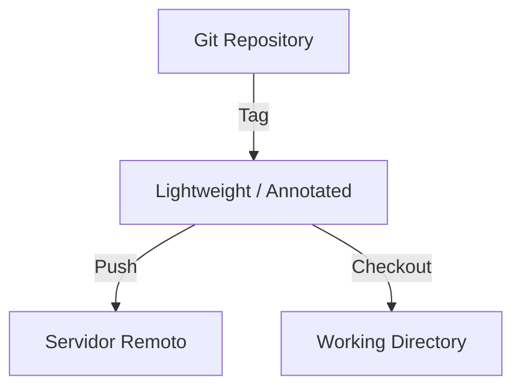

# 🏷️ Trabalhando com Tags no Git

As **tags** no Git são usadas para marcar pontos específicos na história do repositório, geralmente releases ou versões importantes de um projeto.

---

## 🔹 Tipos de Tags

1. **Lightweight Tag**  
   - Marcador simples, sem metadados adicionais.  
   - Recomendada para uso local ou temporário.  

```bash
# Criando uma lightweight tag
git tag "1.0.0"
```

2. **Annotated Tag** 
- Armazena informações adicionais: autor, data e mensagem.
- Ideal para releases ou versões oficiais.

```bash
# Criando uma annotated tag
git tag -a "1.0.0" -m "Versão 1.0.0 - Release inicial"
```

## 📋 Listando Tags
```bash
# Listar todas as tags do projeto
git tag
```

> 💡 **Dica**: Para ver tags com padrões específicos:
```bash
git tag -l "v1.*"
```

## 🚀 Enviando Tags para o Servidor
```bash
# Enviar todas as tags anotadas para o remoto
git push origin --tags
```

> 💡 Observação: Lightweight tags não são enviadas por padrão. Use --tags para 
> garantir que todas as tags sejam compartilhadas.

## 🔄 Usando Tags
**Checkout de uma Tag**
```bash
git checkout 1.0.0
```

> ⚠️ Atenção: Isso coloca o repositório em detached HEAD.
> Se quiser fazer alterações, crie uma branch a partir da tag:
```bash
git checkout -b nova-branch 1.0.0
```

**Excluindo Tags**
```bash
# Local
git tag -d 1.0.0

# Remota
git push origin :refs/tags/1.0.0
```

## 💡 Boas Práticas e Cuidados
1. **Evite sobrescrever tags remotas**

Remova primeiro se precisar atualizar:
```bash
git push origin :refs/tags/1.0.0   # remove do remoto
git push origin 1.0.0             # envia novamente
```

2. **Use tags para releases, não para commits intermediários**

Tags devem marcar pontos importantes e estáveis do projeto.

3. **Combine tags com branches de release**

Marque releases na branch `main` ou `release` para maior confiabilidade.

4. **Versionamento Semântico (SemVer)**

`MAJOR.MINOR.PATCH` indica a natureza das alterações:
- `2.0.0` → mudanças incompatíveis
- `2.1.0` → novas funcionalidades compatíveis
- `2.1.1` → correções de bugs

5. **Evite tags “móveis”**

Crie tags somente em commits definitivos.

6. **Documente a tag**

Use mensagens descritivas em annotated tags:
```bash
git tag -a "1.2.0" -m "Adiciona feature X e corrige bug Y"
```

## 🎯 Resumo Visual

