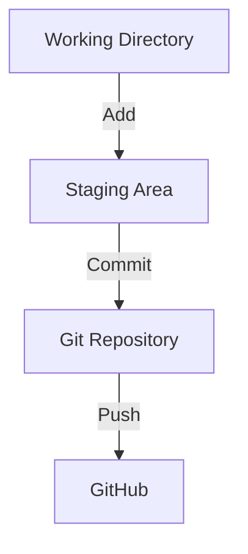
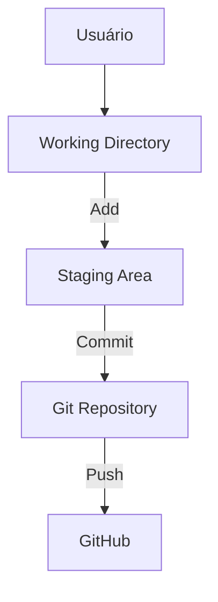

# ⚡ Trabalhando com Git no VS Code

O **VS Code** trouxe grandes facilidades para trabalhar com Git visualmente, permitindo que você veja alterações, gerencie branches e resolva conflitos sem sair da IDE.

---

## 1️⃣ Controle de Versão Integrado
- VS Code já vem com suporte nativo ao Git.  
- Permite ver arquivos modificados, adicionar à stage area e fazer commits diretamente na interface.  
- **Visual:** cada arquivo modificado aparece com cores no Explorer:
  - 🟢 Verde → novo arquivo  
  - 🔵 Azul → modificado  
  - 🔴 Vermelho → deletado  

---

## 2️⃣ Painel de Source Control
- Acesse pelo ícone `Source Control` na barra lateral (ou `Ctrl+Shift+G`).  
- Funcionalidades principais:
  - Adicionar arquivos à stage area  
  - Criar commits  
  - Visualizar histórico de mudanças  
  - Resolver conflitos  



## 3️⃣ Extensões Úteis
- **GitLens** → histórico detalhado, autores por linha, visualização de commits, comparação de versões.
- **Git Graph** → grafo interativo de branches e merges.
- **GitHub Pull Requests and Issues** → cria e gerencia PRs e issues diretamente no VS Code.

## 4️⃣ Resolver Conflitos Visualmente

O **VS Code** detecta conflitos automaticamente durante merge ou rebase.

Os botões visuais permitem escolher:

- **Current Change** → manter a versão atual
- **Incoming Change** → aceitar a versão de entrada
- **Both Changes** → combinar alterações

💡 Mais intuitivo que o terminal (`git mergetool`) e reduz risco de erros.

**Exemplo visual de conflito:**
```text
<<<<<<< HEAD
Versão atual
=======
Versão do branch remoto
>>>>>>> branch-remoto
```

## 5️⃣ Dicas Práticas
- Configure o VS Code como editor padrão do Git:
```bash
git config --global core.editor "code --wait"
```
- Abra o repositório diretamente no VS Code para que o controle de versão seja carregado automaticamente.
- Use **GitLens** para explorar o histórico detalhado sem sair da IDE.
- Combine commits frequentes com mensagens claras para manter o histórico limpo.
- Utilize **Git Graph** para visualizar merges, rebase e fluxo de branches de forma interativa.

## 🎯 Resumo Visual do Fluxo VS Code + Git

